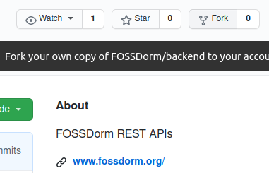
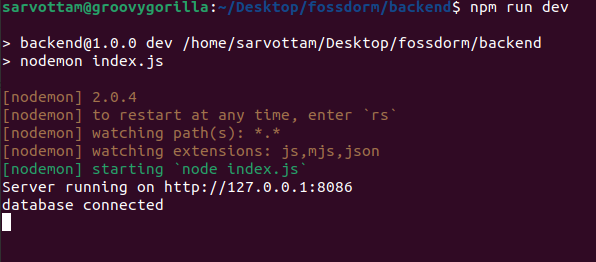
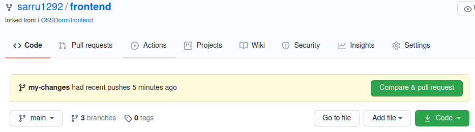
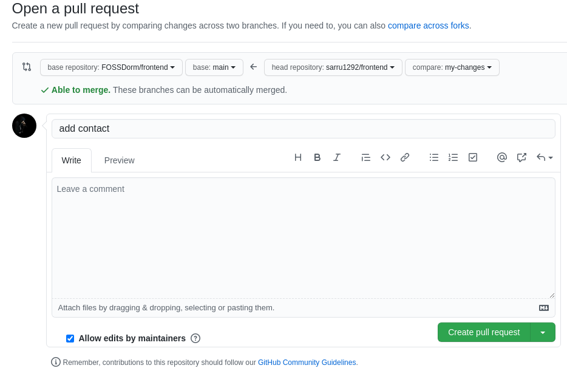

<p align="center"></p>
<h1 align="center">FOSSDorm</h1>

<div align="center">
  <strong>Build your open source profile</strong><br>
  A <a href="https://www.gnome.org/challenge/">GNOME Challenge 2020 </a> project that aims to bring, engage, and retain new contributors to the open source community.
</div>
<br/>
FOSSDorm is a free and open source platform to help newcomers find open source projects based on their skill preference, then learn how to contribute to the selected project, and engage them for the long term.

<br/>

To achieve the same target, FOSSDorm aims to fulfills three basic needs:

1. <strong>Where to find skill-based suitable project:</strong> GitHub is a large ocean where new contributors find hard to search for project meeting their demands. Hence, FOSSDorm provides a list of all verified and approved (by us) open source projects.
2. <strong>How to contribute:</strong> Even after finding a project, contributors sometimes fail to engage with the community due to lack of good documentation for beginners. Hence, each project on FOSSDorm contains a separate page providing all informations about the project, how to set up a project at localhost, guide for contribution, and how to stay in touch with the community.
3. <strong>How to engage contributors forever:</strong> FOSSDorm also has reward system that helps contributors build their profile displaying the amount of open source contribution they've done to the projects listed at FOSSDorm.

## Open Source Tools Used By FOSSDorm
We at FOSSDorm highly promotes the open source softwares and hence use them as well against the proprietary or closed softwares.
- [Node.js](https://nodejs.org/)
  
- [NPM](https://www.npmjs.com/)
  
- [React.js](https://reactjs.org/)
  
- [Inkscape](https://inkscape.org/)
  
- [Storybook](https://storybook.js.org/)
  
- [Sass](https://sass-lang.com/)
  
- [Bootstrap](https://getbootstrap.com/) 
  
- [Semantic UI](https://semantic-ui.com/)
  
- [Postman](https://www.postman.com/)

- [Robo 3T](https://robomongo.org/)
  
#### Special mention to [Fosshost](https://fosshost.org/), who provides free hosting to FOSS projects including FOSSDorm.

## How To Contribute To FOSSDorm project (Backend)?

### Set up local environment
Before setting up project locally, you must have the following tools installed on your system:
- Git
- Mongodb database
- NPM

**1. Fork the backend repository**

<p align="center"></p>

**2. Clone your own copy of repo**

```
git clone https://github.com/<username>/backend.git
```
Here replace `<username>` with your own github username

**3. Install dependencies**

```
cd backend
npm install
```
**4. Set Up localhost database**

Once you install MongoDB on your system, run it and copy the URI address.

**5. Add environment variables**

Create `.env` file at the root of your project with the following entries and its values:
```
MONGODB_URI=<your_monogodb_uri_copied_in_last_step>
WEBSITE_URL="https://www.fossdorm.org"
```

**5. Run API server at localhost**

```
npm run dev
```
If you're able to see website running at localhost, then you're ready to make change and contribute.
<p align="center"></p>

### Make changes and create pull request
**1. Create your own branch and checkout**

Though you can also make changes in your `main` branch and create pull request, we highly recommend you to make your own new branch and checkout to it before making any changes.

```
git branch <new-branch-name>
git checkout <new-branch-name>
```
Here replace `<new-branch-name>` with a new branch name you want to give. e.g. `git branch my-changes`
<br/>
Now, make sure you're on the new branch.
```
git branch
```

**2. Make changes**

Once you switch to a new branch, make changes you want.

**3. Commit new changes**
Once you're done testing your new changes at localhost, save the work by running commands:
```
git add .
git commit -m "<message>"
```
Here replace `<message>` with a small description of your new changes. e.g. "add project api", "fix connection".

**4. Push local changes to remote**
```
git remote --set-upstream origin <new-branch-name>
```
If you're prompted to enter GitHub username and password, enter your credential and you're ready to create a pull request.

Next time, you can only run `git push origin` to push new changes to remote.

**5. Create pull request**

Once you push all changes to your remote GitHub server, go to your own GitHub account >> `backend` repo and you'll see a notification of new changes.

<p align="center"></p>

Click on the "Compare & pull request" and then open a pull request from the next page.
<p align="center"></p>
Leave a comment if you want to add any message in detail.

### Update your local repo with parent repo

To sync your local or remote repo with parent repo (from where you've forked), run commands:

```
git remote add upstream https://github.com/FOSSDorm/backend.git

git pull upstream main

```
<br/> 

**Note:** At localhost, you may find redirecting to production site in the login system. This happens as the GitHub OAuth callback is set to production site. To make it work on localhost, I need to change the callback url. Hence, currently, you may work on other components of website until I find its solution. 

## Contact Us
If you've any doubt or want to ask any question, feel free to message us through [mail](mailto:sarru1291@gmail.com), [slack](https://join.slack.com/t/fossdorm/shared_invite/zt-imvn58kj-blkO4r49JHX58l9ioB0eAg), or [telegram](https://t.me/fossdorm).
